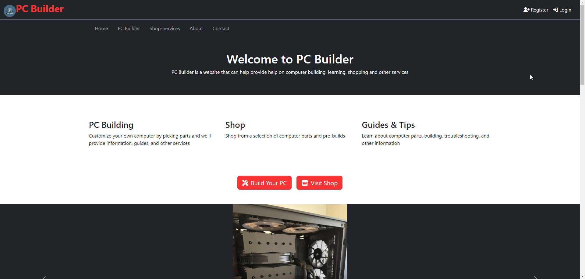

# Full-Stack Web Application

This project is a full-stack web application based on a simple idea that mirrors my interest for technology and web development and ambitions for building computers. The website utilizes the MEAN stack (MongoDB, Express.js, Angular, and Node.js) and MongoDB Atlas for the database. My development journey showed me the fundamentals of full-stack programming and connecting everything together.

full README documentation soon...

## Features

- Home Page to get started and showcase
- Interactive PC Builder to choose different components and how to save the results
- Shop Services to explore computer parts provided by the database to vendors
- Typical other pages and sections that Ecommerce sites have
- User registration (though no real purpose yet) using RESTful API Endpoints
- Admin dashboard, an interface for content management with CRUD operations and database access
- MongoDB Atlas for database management for storing and retrieving information
- ...

## Prerequisites / Built With

- Front-end: Angular Framework
- Back-end: MongoDB and Mongoose, Express.js frameowrk, Node.js runtime environment
- Database: MongoDB Atlas for cloud-based database
- Tools Used: Thunder Client, NPM, FontAwesome, Bootstrap, ...

## Setup / (How to Run or View?)

1. Clone the repository using: `git clone https://github.com/HernandezA1007/Full-Stack-Website.git`.
2. Navigate to project directory and install dependencies: `npm install`.
3. Launch the application locally using: `ngx ng serve` or `ng serve` for front-end. and `node app.js` for back-end.
4. Access the app by visiting: `http://localhost:4200` in your browser.

## Development Roadmap ?

- [x] Front-end: Angular Framework
    - [x] Web pages
    - [x] Forms
    - [ ] Implement services...
    - [ ] ...
    - [ ] ...
- [x] Back-end: Express and Node.js
    - [ ] Set up Node.js server
    - [ ] Develop RESTful APIs using Express
    - [ ] ...
    - [ ] ...
- [x] Database: MongoDB Atlas
    - [x] Design database schema
    - [ ] ...
- [x] Connect the Projects
    - [ ] ...
- [ ] ...
- [ ] ...

## Gallery

(screenshots and progress)

## Future Enchancements

1.
2.
3.
